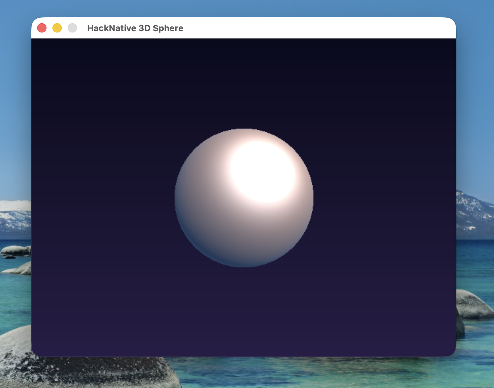

# HackNative

A native compiler for a Hack-inspired language, powered by LLVM. Compiles Hack-style source code directly to machine code — no VM, no interpreter.



## Features

- **Native compilation** via LLVM IR → machine code
- **Hack-compatible syntax**: functions, classes, interfaces, `vec`, `dict`, `foreach`, async/await style
- **C FFI** using HHI-style declarations (`function name(params): type;`)
- **`require`** for including declaration files (`.hhi`)
- **4 polymorphic dispatch strategies**: vtable, fat pointer, type tag, monomorphize
- **Interactive explorer** with side-by-side Hack source / LLVM IR view

## Quick Start

### Prerequisites

- LLVM (via Homebrew: `brew install llvm`)
- CMake
- SDL2 (for the demo: `brew install sdl2`)

### Build

```bash
cd hacknative
mkdir -p build && cd build
cmake ..
make -j$(sysctl -n hw.ncpu)
```

### Run the 3D Sphere Demo

```bash
./build/hackc sdl2/main.hack -o /tmp/sphere --link-flags "-L/opt/homebrew/lib -lSDL2"
/tmp/sphere
```

### Usage

```bash
# Compile and run
./build/hackc <file.hack> -o <output> [--link-flags "..."]

# Dump LLVM IR
./build/hackc <file.hack> --dump-ir

# Dump AST
./build/hackc <file.hack> --dump-ast
```

## C FFI

Declare external C functions using Hack's HHI syntax — a function signature ending with `;` instead of a body:

```hack
// sdl2.hhi
function SDL_Init(int $flags): int;
function SDL_CreateWindow(string $title, int $x, int $y, int $w, int $h, int $flags): string;
function SDL_Quit(): void;
```

```hack
// main.hack
require "sdl2.hhi";

<<__EntryPoint>>
async function main(): Awaitable<void> {
  $init = SDL_Init(32);
  // ...
}
```

Link external libraries with `--link-flags`:

```bash
./build/hackc main.hack -o app --link-flags "-lSDL2 -lm"
```

## Language Overview

```hack
// Functions
function add(int $a, int $b): int {
  return $a + $b;
}

// Classes
class Point {
  public int $x;
  public int $y;
  public function sum(): int {
    return $this->x + $this->y;
  }
}

// Interfaces + dispatch strategies
interface Shape {
  public function area(): int;
}

impl vtable {
  function showArea(Shape $s): void {
    echo $s->area();
  }
}

// Collections
$v = vec[1, 2, 3];
$d = dict["a" => 1, "b" => 2];

// Loops
foreach ($d as $key => $val) {
  echo $key;
}
```

## Project Structure

```
hacknative/
├── lexer.h / lexer.cc       # Tokenizer
├── parser.h / parser.cc     # AST parser
├── codegen.h / codegen.cc   # LLVM IR generation
├── main.cc                  # CLI driver
├── runtime.c                # Runtime library (strings, vec, dict, SDL2 helpers)
├── explorer.html            # Interactive source/IR explorer
├── sdl2/
│   ├── main.hack            # 3D raytraced sphere demo
│   └── sdl2.hhi             # SDL2 function declarations
└── CMakeLists.txt
```

## Explorer

Launch the interactive explorer to view Hack source alongside generated LLVM IR:

```bash
python3 explorer.py
```

Then open `http://localhost:8080` in your browser.

## License

MIT
